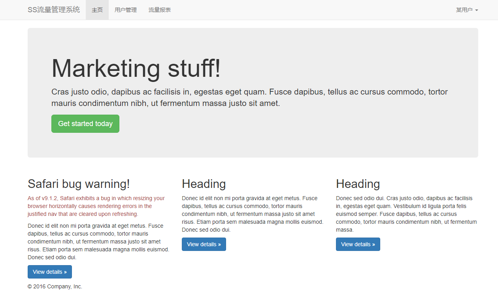
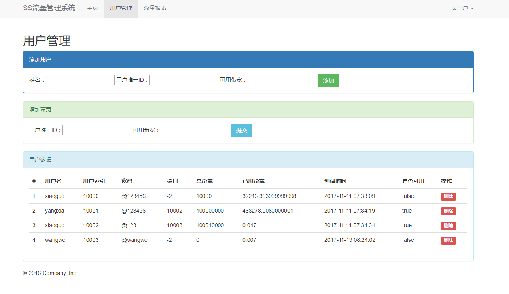
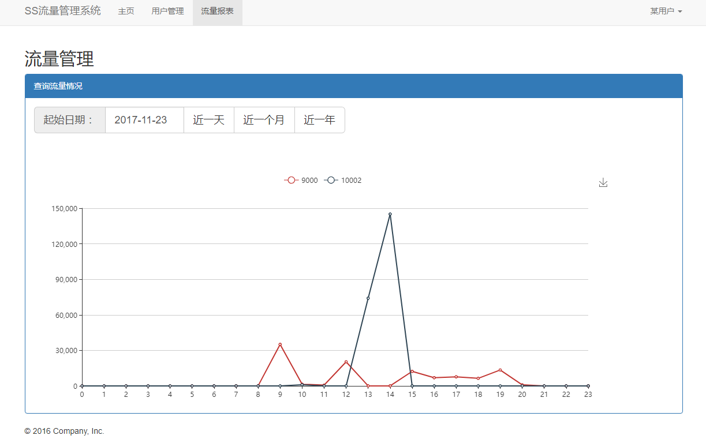

## ShadowSocks服务器流量端口管理接口

本程序主要是管理ShadowSocks的流量和端口，利用后台线程监听udp的统计报文，同时传输命令给ShadowSocks。用法很简单，开箱即用。

##### 启动ss-manage-mini
首先安装ShadowSocks。
```bash
apt-get install python-pip
pip install shadowsocks
vim /etc/shadowsocks.json
```
下面是配置文件。
```json
{
    "server":"*******",
    "server_port":9000,
    "local_address": "127.0.0.1",
    "local_port":1080,
    "password":"******",
    "timeout":300,
    "method":"aes-256-cfb",
    "fast_open": false
}

```
启动服务器。
```bash
ssserver --manager-address 127.0.0.1:8088 -c /etc/shadowsocks.json -d start
```
这时，你可以直接用你的端口和密码上网。同时8080就是udp的连接端口。下载本程序，然后修改config.py程序的49行。
```python
    # ss服务器地址
    SSSERVER_ADDR = (u'127.0.0.1', 8088)
```
这时执行，```pip install -r requirements.txt```安装必须库，直接运行即可，```python manage.py```。

##### 接口描述
- 新增端口
```url``` : ```/add-port```
```method``` :```POST```
```param``` :

```json
name:xiaoguo
password:@123
user_id:10002
bandwidth:10000
```
```response``` :

```json
{"code":200, "msg":"ok", "content": {"port": 10001}}
```
- 更新用户信息与带宽
```url``` : ```/update-user```language
```
```method``` :```POST```
```param``` :

```json
name:xiaoguo
password:@123
user_id:10002
bandwidth:10000
```
```response``` :

```json
{"code":200, "msg":"ok", "content": null}
```

- 删除用户端口
```url``` : ```/remove-port```
```method``` :```POST```
```param``` :

```json
port:10001
```
```response``` :

```json
{"code":500, "msg":"ok", "content": "not found the port!"}
```

- 查询用户端口
```url``` : ```/query-port```
```method``` :```GET```
```response``` :

```json
{"code":200, "msg":"ok", "content": [{"bandwidth": 10000.0, "create_time": "2017-11-09 20:57:44", "user_id": 10000, "name": "xiaoguo", "bandwidth_used": 0.0, "active": true, "password": "@123", "id": 1, "port": 10001}, {"bandwidth": 10000.0, "create_time": "2017-11-09 20:57:44", "user_id": 10001, "name": "xiaoguo", "bandwidth_used": 0.0, "active": true, "password": "@123", "id": 2, "port": 10002}, {"bandwidth": 10000.0, "create_time": "2017-11-09 21:07:11", "user_id": 10001, "name": "xiaoguo", "bandwidth_used": 18000.0, "active": false, "password": "@123", "id": 3, "port": -2}, {"bandwidth": 30000.0, "create_time": "2017-11-09 21:07:11", "user_id": 10002, "name": "xiaoguo", "bandwidth_used": 18000.0, "active": true, "password": "@123", "id": 4, "port": 10001}]}
```

- 查询某个用户端口
```url``` : ```/query-port/<port>```
```method``` :```GET```
```response``` :

```json
{"code":200, "msg":"ok", "content": {"bandwidth": 10000.0, "create_time": "2017-11-09 20:57:44", "user_id": 10000, "name": "xiaoguo", "bandwidth_used": 0.0, "active": true, "password": "@123", "id": 1, "port": 10001}}
```

- 查询用户流量
```url``` : ```/stat```
```method``` :```GET```
```response``` :

```json
{"code":200, "msg":"ok", "content": [{"create_time": "2017-11-09 05:16:53", "bw_use": 83.561, "user_id": -1, "id": 1, "port": 9000}, {"create_time": "2017-11-09 05:16:53", "bw_use": 46.751, "user_id": -1, "id": 2, "port": 9000}, {"create_time": "2017-11-09 05:16:53", "bw_use": 1.655, "user_id": -1, "id": 3, "port": 9000}, {"create_time": "2017-11-09 05:16:53", "bw_use": 0.145, "user_id": -1, "id": 15, "port": 9000}]}
```

- 查询某个用户流量
```url``` : ```/stat/<port>```
```method``` :```GET```
```response``` :

```json
{"code":200, "msg":"ok", "content": [{"create_time": "2017-11-09 05:16:53", "bw_use": 83.561, "user_id": -1, "id": 1, "port": 9000}, {"create_time": "2017-11-09 05:16:53", "bw_use": 46.751, "user_id": -1, "id": 2, "port": 9000}, {"create_time": "2017-11-09 05:16:53", "bw_use": 1.655, "user_id": -1, "id": 3, "port": 9000}, {"create_time": "2017-11-09 05:16:53", "bw_use": 0.145, "user_id": -1, "id": 15, "port": 9000}]}
```

##### 图形界面管理
为了方便单节点的管理，增加灵活性，为单节点设置了3个简单界面，完成基本管理，分别是主页、用户管理、流量报表，好用的很，都是ajax交互。



